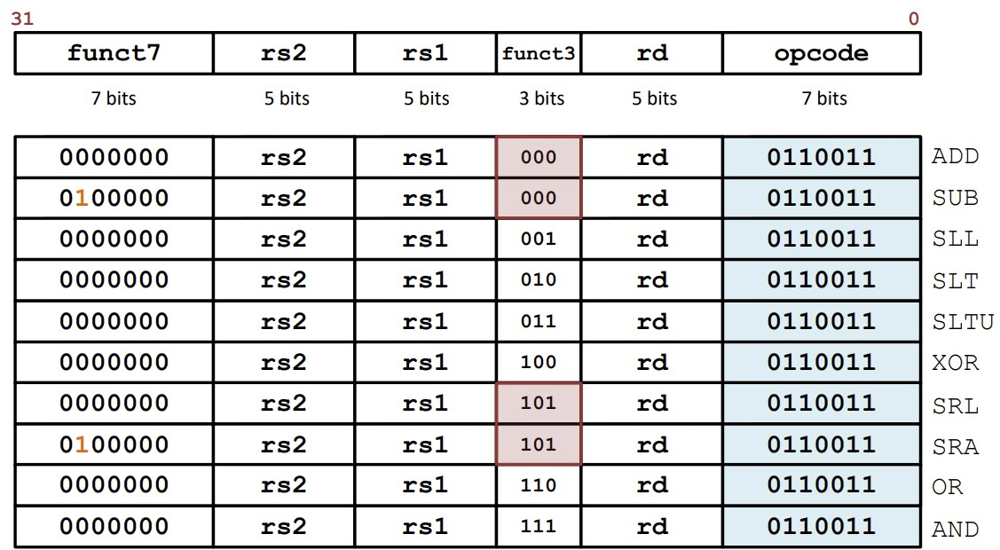

# Computer-Architecture
A UCONN course


### Helpful Resources

C Bitwise Operators: [https://www.youtube.com/watch?v=BGeOwlIGRGI](https://www.youtube.com/watch?v=BGeOwlIGRGI)


### RISC V




### GDB Debugger

1. Start GDB debugger for code compilation

    ```bash
    gdb ./simulator
    ```

2. Set a Breakpoint where you want to

    ```bash
    (gdb) break main
    ```

3. Run the Program: Start running the program:

    ```bash
    Copy code
    (gdb) run
    ```
    > The program will run and pause at the breakpoint you've set.
    
4. Find the Struct Information: If you know the name of the struct instance, use the `ptype` command to print the type  definition of the struct. This will reveal all its members.

    For example:

    ```bash
    (gdb) ptype struct_instance
    ```
    > This will print the struct definition, including the data members (names and types).
